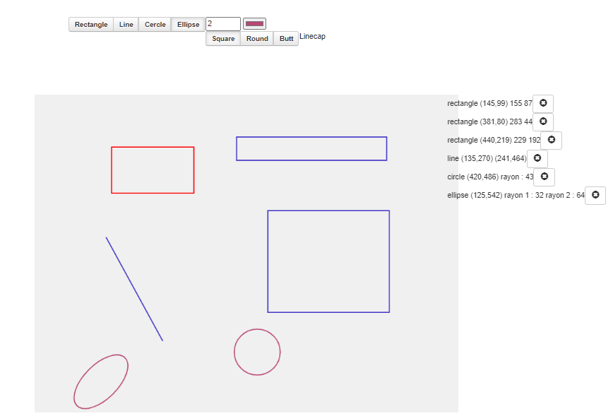

## TP Web : Javascript et HTML5

The goal of this project is to manually build a web application that is complex enough to 
require the implementation of a client-side MVC develop web services according to the REST architecture.
it consists in creating a web application to do vector drawing, i.e. to draw rectangles, lines, as well as to define their colour and line thickness. 
The figure below shows the state of the application and therefore the objective to be achieved. 

 

 

## Getting Started

Clone the project: https://github.com/Ehuar/tpWeb.git

## Prerequisites

•	a text editor (Visual Studio Code, NotePad ...)

## Start-up

To start the project, you must open  <strong> canvas.html </strong> in a navigator

## how does it work?
The interface is composed of a drawing area, several buttons for the shape (rectangle, line, circle and ellipse), 
a text area to define the thickness of the lines of the drawn figure, an area to choose the colour.

First you can choose the thickness and colour of your figure. 
Then you choose the figure you want to draw and draw it on the drawing area.
You can also delete a figure.

## Built With

•	JavaScript  

•	HTML  

•	CSS

## Authors

This project was developed by these students: 

•	Rebecca EHUA  

•	Maurice AKA  

•	Franck KOUAMELAN

note that this work would not be done without having forked the project that our teacher gave us, sir <strong>Olivier BARAIS</strong>.  
Thanks for your help and your time!!!

